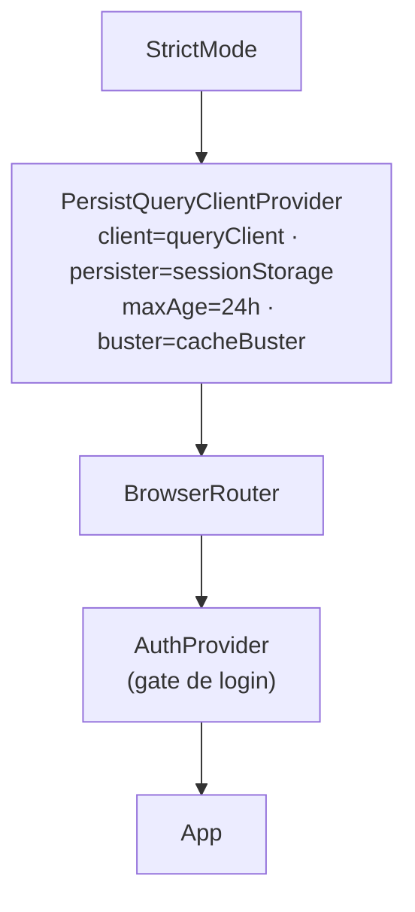
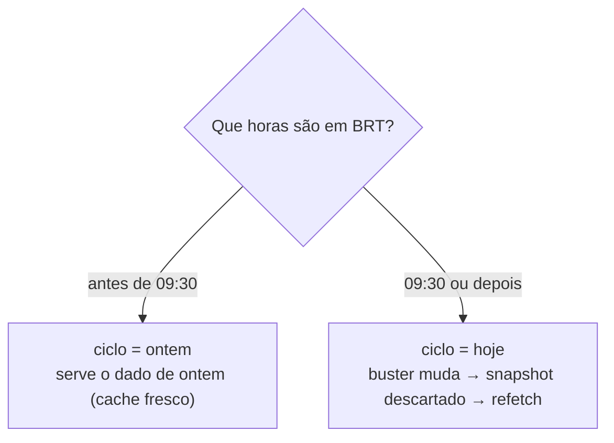
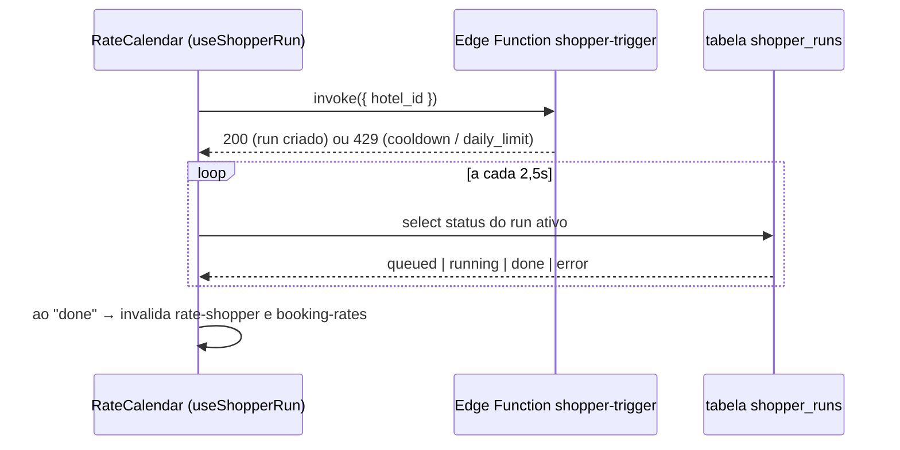

# WEBAPP — HoGrow Revenue Intelligence (front-end)

- **Dono:** TODO
- **Última revisão:** 2026-06-16
- **Fontes:** `package.json`, `vite.config.ts`, `vercel.json`, `tsconfig.json`, `tsconfig.app.json`, `eslint.config.js`, `index.html`, `src/main.tsx`, `src/App.tsx`, `src/lib/supabase.ts`, `src/lib/queryClient.ts`, `src/lib/auth.tsx`, `src/lib/booking.ts`, `src/lib/utils.ts`, `src/hooks/useSupabase.ts`, `src/hooks/useClientes.ts`, `src/hooks/useEventos.ts`, `src/hooks/useShopperRun.ts`, `src/data/*`, `src/components/**`, `src/pages/**`, `src/index.css`

Front-end do **HoGrow Revenue** — o projeto de *revenue intelligence* hoteleira da empresa **HoGrow**. Portfólio de hotéis-cliente, receita/ocupação/RevPAR por mês e por dia, metas, calendário de tarifas do Booking (rate shopper) e cadastro de clientes/concorrentes. É uma **SPA** React que lê dados do Supabase via *views*, *RPCs* e *Edge Functions*.

> Este README é autossuficiente: descreve a stack real, como rodar, a estrutura de `src/`, as páginas e seus contratos de dados, o modelo de cache e o deploy. Não cita bibliotecas removidas nem hotéis fictícios.

---

## 1. Stack

| Camada | Tecnologia | Versão (semver no `package.json`) |
|---|---|---|
| UI | **React 19** (`react`, `react-dom`) | `^19.0.0` |
| Linguagem | **TypeScript** | `~5.6.2` |
| Build / dev server | **Vite 6** | `^6.0.5` |
| Estilo | **Tailwind CSS v4** (via plugin Vite, sem `tailwind.config.js`/`postcss.config.js`) | `^4.0.0` |
| Estado de servidor / cache | **TanStack Query v5** + persistência | `@tanstack/react-query`, `@tanstack/react-query-persist-client`, `@tanstack/query-sync-storage-persister` `^5.101.0` |
| Roteamento | **react-router 7** (`react-router-dom`) | `^7.1.1` |
| Backend client | **@supabase/supabase-js** | `^2.99.2` |
| Planilhas | **xlsx** (SheetJS, template de metas — import dinâmico) | `^0.18.5` |
| Ícones | **lucide-react** | `^0.469.0` |
| Datas | **date-fns** | `^4.1.0` |
| Utilitário de classes | **clsx** (helper `cn`) | `^2.1.1` |

Lint/typecheck: `eslint 9` + `typescript-eslint 8` (flat config em `eslint.config.js`). O TypeScript usa *project references* (`tsconfig.json` → `tsconfig.app.json`, com alias `@/* -> src/*`).

> Recharts **não** é usado. Não há dependência de biblioteca de gráficos; os visuais são construídos com componentes próprios e estilo inline + Tailwind.

---

## 2. Como rodar

Pré-requisitos: **Node.js 18+** (recomendado 20+) e **npm**.

```bash
# 1. instalar dependências
npm install

# 2. criar o arquivo .env (ver seção 3) na raiz do WEBAPP

# 3. dev server (http://localhost:5173 por padrão)
npm run dev

# 4. build de produção (type-check + bundle em dist/)
npm run build

# 5. servir o build localmente para conferência
npm run preview
```

Scripts (`package.json`):

| Script | Comando | O que faz |
|---|---|---|
| `dev` | `vite` | Dev server com HMR |
| `build` | `tsc -b && vite build` | Type-check (project refs) + bundle em `dist/` |
| `lint` | `eslint .` | Lint do projeto |
| `preview` | `vite preview` | Serve o `dist/` gerado |

---

## 3. Variáveis de ambiente

O client Supabase (`src/lib/supabase.ts`) lê **exatamente duas** variáveis `VITE_*` e **lança erro** se qualquer uma faltar (`Missing Supabase environment variables`).

| Variável | Uso | Obrigatória |
|---|---|---|
| `VITE_SUPABASE_URL` | URL do projeto Supabase | Sim |
| `VITE_SUPABASE_ANON_KEY` | Chave anônima/pública (anon key) | Sim |

Crie um arquivo `.env` na raiz do `WEBAPP` (já ignorado pelo `.gitignore`):

```dotenv
VITE_SUPABASE_URL=https://<seu-projeto>.supabase.co
VITE_SUPABASE_ANON_KEY=<sua-anon-key>
```

No Vercel, defina as mesmas duas variáveis nas *Project Settings → Environment Variables*. Como o prefixo é `VITE_`, elas são embutidas no bundle no momento do build (são chaves públicas — não coloque aqui nenhuma `service_role`).

---

## 4. Estrutura de `src/`

```
src/
├─ main.tsx                 entry point: empilha os providers (ver seção 5)
├─ App.tsx                  rotas (react-router 7), Layout e gate de auth
├─ index.css               Tailwind v4 (@import "tailwindcss") + tokens de tema
├─ vite-env.d.ts
│
├─ pages/                   uma página por rota
│  ├─ Home.tsx
│  ├─ Clientes.tsx
│  ├─ ClienteDetalhe.tsx
│  ├─ Metas.tsx
│  ├─ Feriados.tsx
│  ├─ Cadastro.tsx
│  ├─ Login.tsx
│  └─ NotFound.tsx
│
├─ components/
│  ├─ layout/              Navbar, PageContainer, ErrorBoundary, UserMenu
│  ├─ cards/               PerformanceCard
│  ├─ forms/               ClienteFormModal, HotelEditForm
│  ├─ metas/               MetasExcelCard, MetasModal, MetasUploadLog
│  ├─ rateshop/            RateCalendar, RateDayModal
│  ├─ tables/              PickupSection, PickupTable, PickupMensalTable
│  └─ ui/                  PeriodSelector, ExtracaoCalendar, ModalShell, Skeleton, axisPanel
│
├─ hooks/                   acesso a dados (TanStack Query + Supabase)
│  ├─ useSupabase.ts       maioria dos hooks de leitura/mutação (views/RPCs)
│  ├─ useClientes.ts       Cadastro (CRUD via Edge Function hotel-write)
│  ├─ useEventos.ts        Feriados (CRUD via Edge Function evento-write)
│  └─ useShopperRun.ts     rate shopper on-demand (polling de shopper_runs)
│
├─ lib/
│  ├─ supabase.ts          createClient(VITE_SUPABASE_URL, VITE_SUPABASE_ANON_KEY)
│  ├─ queryClient.ts       cache atrelado ao ciclo de dados 09:30 BRT
│  ├─ auth.tsx             AuthProvider / useAuth (gate de UX)
│  ├─ booking.ts           parse/validação de URLs do Booking.com
│  └─ utils.ts             cn, formatadores pt-BR, chaves de data, STATUS_CONFIG
│
└─ data/                    modelos e transformações (sem I/O)
   ├─ types.ts             HotelRow, ReceitaDiariaRow, HotelSummary, HotelMeta, BookingRate...
   ├─ transforms.ts        parseKpiRow, deriveStatus, buildHotelSummary
   ├─ eventos.ts           tipos de eventos/feriados + expansão de recorrência
   └─ uf.ts                tabela das 27 UFs + helpers
```

`public/` contém os SVGs de logo (`logo-hogrow.svg`, `logo-hogrow-navy.svg`). O `index.html` define `lang="pt-BR"`, título `HoGrow — Revenue Intelligence` e carrega as fontes `Inter` e `JetBrains Mono`.

---

## 5. Árvore de providers (entry point)

`src/main.tsx` empilha os providers de fora para dentro:



A persistência do cache exclui propositalmente as queries que mudam fora do ciclo diário: o `dehydrateOptions.shouldDehydrateQuery` só persiste queries `status === 'success'` cuja primeira chave **não** comece com `cliente-rate-shopper`, `booking-rates`, `metas-` ou `eventos-hotel` (ver seção 8).

---

## 6. Páginas, rotas e contratos de dados

Roteador em `src/App.tsx` (react-router 7). Páginas carregadas com `React.lazy` + `Suspense`. O `ErrorBoundary` é re-montado por rota (`key={pathname}`).

- `/login` — **pública**. Se já autenticado, redireciona para `/`.
- As demais rotas são **protegidas** por composição: `element = user ? <Layout/> : <Navigate to="/login"/>`. O `Layout` é `Navbar` + `PageContainer`.

| Rota | Página | Papel | Hooks → fonte de dados |
|---|---|---|---|
| `/` | `Home.tsx` | Portfólio: 4 indicadores no hero + tabela ordenável/buscável de todos os hotéis-cliente (receita do mês, OCC, RevPAR, % meta, pick-up). Linha → `/clientes/:id`. | `useHomePage` → RPC `rpc_home_page(p_mes_ano, p_data_extracao)` |
| `/clientes` | `Clientes.tsx` | Tabela analítica de receita por referência (mês + extração + faixa de dias): Meta/Real/Δ vs Meta/MoM/YoY + grupo "Acumulado Ano". Busca via `?q=`. | `useClientesCalendar` → RPC `rpc_clientes_calendar`; `useClientesTable` → RPC `rpc_clientes_table` |
| `/clientes/:id` | `ClienteDetalhe.tsx` | Dashboard de 1 hotel: 6 `PerformanceCard`, seção de pick-up, calendário de tarifas e aba "Editar". | `useClienteDetalheHeader/_calendar/_cards` → RPCs `rpc_cliente_detalhe_header/_calendar/_cards`; `useClientePickupDiario` → `rpc_cliente_pickup_diario`; `usePickupMensalKpis` → `rpc_cliente_pickup_mensal`; `useClienteRateShopper[ForMonths]` → `rpc_cliente_rate_shopper`; `updateHotel` |
| `/metas` | `Metas.tsx` | Gestão de metas: "Visão anual" (só leitura) e "Lançar metas" (template Excel + upload). | `useMetasAnual` → RPC `rpc_metas_anual(p_ano)`; `useMetasUploadLog` → tabela `metas_upload_log`; upload via Edge `metas-upload` |
| `/feriados` | `Feriados.tsx` | CRUD de eventos/feriados por abrangência (nacional/estadual/municipal/hotel) com recorrência. | `useEventos` → tabela `evento`; `useHoteisCliente`; mutações via Edge `evento-write` |
| `/cadastro` | `Cadastro.tsx` | CRUD de hotéis-cliente + concorrentes (lista paginada client-side, busca, toggle ativo, modal). | `useClientesAdmin` → `hotel` + `hotel_booking_info`; mutações via Edge `hotel-write` |
| `/login` | `Login.tsx` | Login usuário/senha. | `useAuth().login` |
| `*` | `NotFound.tsx` | 404 estilizado. | — |

Hooks **compartilhados** (em `useSupabase.ts`) usados por cards/listas: `useHotels` (`vw_hotel_summary`), `useHotelDetail` (`hotel` + `vw_hotel_receita_diaria_atual`), `useHotelsMonthly` (`vw_hotel_monthly_kpis`), `usePickup` (`vw_pickup_diario`), `useBookingRates[ForMonths]` (`vw_booking_rates_latest`), `useHotelMetas`/`useAllMetas` (`hotel_metas`), `usePickupAcumuladoMensal` (`pickup_acumulado`).

> Convenção: as páginas nunca fazem `select *` espalhado — cada tela consome **uma RPC** ou uma *view* com colunas já no formato da UI. Os nomes acima (RPCs, views, Edge Functions) são os literais usados no código.

---

## 7. Autenticação (gate de UX, não fronteira de segurança)

`src/lib/auth.tsx` expõe `AuthProvider` e `useAuth()` (`user`, `login(username, password)`, `logout()`).

- Login compara um usuário fixo e um **hash SHA-256** da senha (calculado via `crypto.subtle.digest`); a sessão é guardada em `localStorage` e restaurada de forma síncrona (sem *flash* de login).
- As rotas protegidas são resolvidas em `App.tsx` por composição (`user ? <Layout/> : <Navigate to="/login"/>`).

> **Importante:** como é uma SPA, a lógica e o hash da senha ficam no bundle e os dados já são lidos com a **anon key pública**. Portanto isto é um **portão de UX**, não uma fronteira de segurança forte. Proteção real exigiria Supabase Auth + RLS. O `logout` está no `UserMenu` ("Sair da conta").

---

## 8. Cache e frescor (ciclo de dados 09:30 BRT)

A estratégia vive em `src/lib/queryClient.ts`. O cache **não** é atrelado à meia-noite: ele segue um **ciclo de dados** cuja fronteira é **09:30 BRT** (`America/Sao_Paulo`, `REFRESH_BOUNDARY_MIN = 9*60+30`). A razão: os dados "de hoje" só existem depois que as pipelines de backend rodam de manhã e as materialized views são atualizadas; antes disso, serve-se o dado de ontem.

Peças principais:

- `dataCycleKey()` — data do ciclo ativo (antes das 09:30 → ontem; às/depois → hoje).
- `msUntilNextRefresh()` — ms até a próxima fronteira 09:30; é usado como `staleTime` global, então qualquer query fica *stale* exatamente quando o dado novo "aterrissa".
- `queryClient` defaults: `staleTime = () => msUntilNextRefresh()`, `gcTime = 24h`, `retry = 1`, `refetchOnWindowFocus = true`.
- `persister = createSyncStoragePersister({ storage: window.sessionStorage, key: 'hogrow-query-cache-v2' })` — o cache persiste no **sessionStorage** (sobrevive a F5/reload, some ao fechar a aba).
- `cacheBuster = dataCycleKey()` — quando o ciclo vira (ontem → hoje), o `buster` muda e o snapshot persistido é descartado na reidratação.



**Hooks que furam o cache** (`staleTime:0`, `gcTime:0`, `refetchOnMount:'always'`), porque mudam fora do ciclo 09:30:

| Hook(s) | Por quê |
|---|---|
| `useBookingRates`, `useBookingRatesForMonths`, `useClienteRateShopper`, `useClienteRateShopperForMonths` | Rate shopper on-demand muda preços a qualquer hora |
| `useMetasAnual`, `useMetasUploadLog` | Metas mudam por upload a qualquer hora |
| `useEventosHotel` | Feriado recém-editado precisa refletir na hora |
| `useClienteCompetitors` | Lista de concorrentes editável; sempre estado atual |

Mutações invalidam apenas as `queryKey` afetadas. Exemplos: `updateHotel` invalida `hotel-detail`, `cliente-detalhe-header`, `hotels-summary`, `clientes-table`, `home-page`; `saveHotelMeta` invalida `metas-page`, `hotel-metas`, `all-metas`, `home-page`, `clientes-table`, `cliente-detalhe-cards`; ao concluir um shopper-run, `useShopperRun` invalida `cliente-rate-shopper[-months]` e `booking-rates[-months]` (escopados por `hotelId`).

---

## 9. Rate shopper on-demand (botão "Atualizar agora")

`src/hooks/useShopperRun.ts` não usa TanStack Query: dispara a Edge Function **`shopper-trigger`** e faz **polling** da tabela `shopper_runs` a cada `POLL_MS = 2500`ms.



O front espelha os limites do back-end apenas para exibição (`COOLDOWN_MS = 15min`, `DAILY_LIMIT = 7`); os limites reais são impostos no servidor.

---

## 10. Deploy (Vercel)

A SPA é estática; o Vercel autodetecta o framework Vite. O único arquivo de configuração é o `vercel.json`, que faz o **fallback de SPA** (toda rota → `/index.html`), necessário para não dar 404 ao recarregar uma sub-rota como `/clientes/15`:

```json
{
  "$schema": "https://openapi.vercel.sh/vercel.json",
  "rewrites": [
    { "source": "/(.*)", "destination": "/index.html" }
  ]
}
```

Passos de deploy:

1. Definir `VITE_SUPABASE_URL` e `VITE_SUPABASE_ANON_KEY` nas variáveis de ambiente do projeto Vercel.
2. Build command `npm run build`, output `dist/` (autodetectado).
3. O `vercel.json` cuida do roteamento client-side.

O Vite (`vite.config.ts`) já separa os vendors em chunks (`vendor-react`, `vendor-supabase`, `vendor-query`, `vendor-icons`) com `chunkSizeWarningLimit: 300`.

---

## 11. Convenções

- `snake_case` (banco) → `camelCase` (hooks/UI), com parsing de numéricos-string em `src/data/transforms.ts` (`parseKpiRow`).
- `deriveStatus(avgOcc)` define o status visual: `<25 critical`, `<45 warning`, `<70 healthy`, senão `excellent`.
- Formatação pt-BR centralizada em `src/lib/utils.ts` (`formatCurrency`, `formatPercent`, etc.).
- Toda escrita (cadastro, metas, feriados, shopper) passa por **Edge Functions** com `service_role`; o front só usa a anon key para leitura. As Edge Functions consumidas são `hotel-write`, `evento-write`, `metas-upload` e `shopper-trigger`.

---

## Veja também

- `RELATORIO_MELHORIAS_FRONTEND.md` — auditoria e roadmap do front-end.
- `docs/supabase-rpcs.md` — contrato das RPCs/views consumidas pelas páginas.
- `docs/metas-upload-validacao.md` — regras de validação do upload de metas.
- `docs/eventos-feriados-db.md` — modelo de dados de eventos/feriados.
- `docs/seletor-periodo-2paineis.md` — spec de UX do seletor de período.
